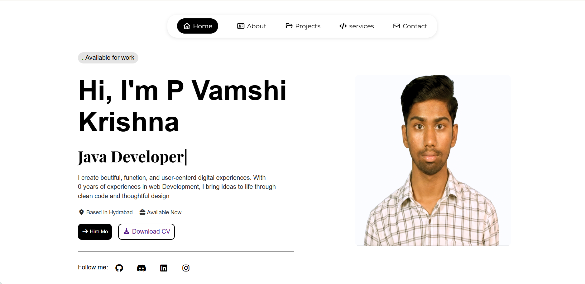

# Portfolio_New

A clean, responsive personal portfolio website to showcase projects, skills, experience, and contact information. This repository contains the source for my portfolio site, a simple, friendly, and easy-to-maintain place to present work to potential employers or collaborators.

> Author: Vamshikrishan  
> Repository: Vamshikrishan/Portfolio_New
> Live: funny-starlight-5b99b0.netlify.app

---

## Table of Contents

- [About](#about)
- [Features](#features)
- [Tech Stack](#tech-stack)
- [Getting Started](#getting-started)
  - [Prerequisites](#prerequisites)
  - [Run Locally](#run-locally)
- [Project Structure](#project-structure)
- [Deployment](#deployment)
- [Customizing](#customizing)
- [Contributing](#contributing)
- [License](#license)
- [Contact](#contact)
- [Acknowledgements](#acknowledgements)

---

## About

This project is a personal portfolio website intended to highlight projects, skills, and background. It focuses on clarity, accessibility, and responsiveness, so it looks great on desktop and mobile devices.

---

## Features

- Clean, minimal design
- Responsive layout for mobile and desktop
- Project gallery / case studies section
- Skills and tools overview
- Contact form or contact links
- Accessibility-friendly semantics and keyboard navigation
- Easy to customize and extend

---

## Tech Stack

This repository is intended to be simple and lightweight. Typical technologies to expect or use:

- HTML5
- CSS3 (or a preprocessor such as SCSS — optional)
- JavaScript (vanilla, or framework of your choice)
- Optional: build tools like npm / Vite / Parcel if you add bundling

Adjust this section to reflect the actual stack used in the repo.

---

## Getting Started

These instructions will get a copy of the project running on your local machine for development and testing.

### Prerequisites

No special prerequisites are required for a static site. For a better development experience, you may want:

- A modern browser (Chrome, Firefox, Edge, Safari)
- A code editor (VS Code, Sublime, Vim)
- Optional: Node.js and npm (if you add build tooling)

### Run Locally

Option A — Quick (no server):
1. Clone the repository
   git clone https://github.com/Vamshikrishan/Portfolio_New.git
2. Open the project folder and open `index.html` in your browser.

Option B — Recommended (simple local server):
1. If you have Python installed, run:
   - Python 3.x:
     python -m http.server 8000
   - Then open http://localhost:8000 in your browser.
2. Or use VS Code Live Server extension or any static file server.

---

## Project Structure

A typical project layout (update this to match your repository):

- index.html — landing/home page
- /assets
  - /css — stylesheets
  - /js — JavaScript files
  - /images — images and screenshots
- /projects — optional project detail pages
- README.md — this file

Please update this section to reflect the actual file layout in your repo.

---

## Deployment

This site is well-suited for static hosting. Popular options:

- GitHub Pages
  - Push branch `main` (or `gh-pages`) and enable Pages in repository settings.
- Netlify — connect the repo and deploy with automatic builds.
- Vercel — connect the repo for instant deployments.

If you use build tooling (e.g., npm + build step), set the build command and publish folder in your hosting provider settings (for example, `dist/`).

---

## Customizing

To personalize the portfolio:
- Replace placeholder text (name, bio, experience).
- Add your projects/screenshots to the projects section.
- Update colors, fonts, and styles in CSS.
- Hook up a real contact form or use a mailto: / form service (Formspree, Netlify Forms, etc.).

---

## Contributing

Contributions are welcome! Suggested workflow:
1. Fork the repository.
2. Create a feature branch: git checkout -b feature/my-change
3. Make your changes and commit: git commit -m "Add feature"
4. Push to the branch and open a pull request.

For issues or ideas, please open an issue describing the request or bug.

---

## License

This project can be licensed as you prefer. A common choice is the MIT License. If you want to use MIT, add a LICENSE file with the MIT text.

---

## Contact

Created by Vamshikrishan — feel free to reach out:

- GitHub: https://github.com/Vamshikrishan
- Email: vamship250106@gmail.com

---

## Acknowledgements

- Template or inspiration sources
- Icons (e.g., Font Awesome)
- Images or illustrations (mention sources or licenses)

---
